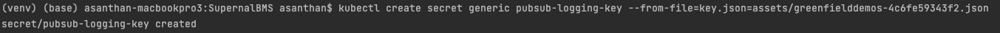
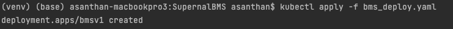
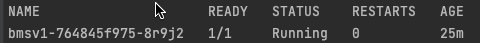
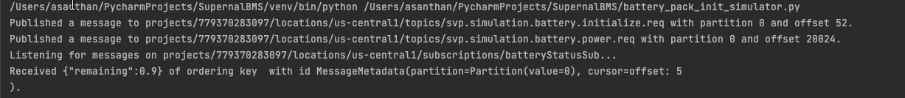

# Overview of Configuring Battery Management Service for SVP Simulation

The following document provides a guided tutorial for deploying Battery Management System service for supporting the Simulation Environment.


## Components 

Following GCP Services are used for deploying the Battery Management Service

-   [Kubernetes - App Deployment](https://cloud.google.com/kubernetes-engine/docs)
-   [Memcached - Key Value Store for Battery State - Optional](https://cloud.google.com/memorystore/docs/memcached)
-   [PubSubLite - Async Message Service](https://cloud.google.com/pubsub/lite/docs)
-   [Artifact Registry - Container Registry](https://cloud.google.com/artifact-registry/docs)
-   [Cloud Shell - Executing the gcloud Commands](https://cloud.google.com/shell)

### Prerequisites

#### Command line Tools

-   [gcloud](https://cloud.google.com/sdk/gcloud/)
-   [kubectl](https://kubernetes.io/docs/reference/kubectl/overview/)
-   [docker](https://docs.docker.com/install/)
-   [pip](https://pip.pypa.io/en/stable/installing/)
-   [git](https://git-scm.com/book/en/v2/Getting-Started-Installing-Git)

#### Enable the following API

 ```shell
 gcloud services enable artifactregistry.googleapis.com \
 #gcloud services enable memcache.googleapis.com \
 gcloud services enable cloudbuild.googleapis.com \
 gcloud services enable container.googleapis.com \
 #gcloud services enable servicenetworking.googleapis.com \
 gcloud services enable pubsublite.googleapis.com \
 gcloud services enable containerregistry.googleapis.com 
  ```

```shell

PROJECT_ID=greenfieldemos
SVP_SVC_ACCT=bms-svc-acct
REGION=us-central1
NETWORK=greenfield--ntwrk
SUB_NETWORK=greenfield-ntwrk-subnet-01
PROJECT_NUMBER=$(gcloud projects describe $PROJECT_ID --format="value(projectNumber)")
gcloud config set project $PROJECT_ID


```

## Architecture


## Deployment

### Download the Code from Git

``` shell
git clone <>
cd SupernalBMS
```


### Setting up Svc Account

Step 1: Create Service Account
``` shell 
gcloud iam service-accounts create $SVP_SVC_ACCT
```

Step 2:
Grant necessary permissions on the Service Account

``` shell
gcloud projects add-iam-policy-binding $PROJECT_ID \
  --member='serviceAccount:$SVP_SVC_ACCT@$PROJECT_ID.iam.gserviceaccount.com' \
   --role='roles/pubsublite.editor'
   
gcloud projects add-iam-policy-binding $PROJECT_ID \
  --member='serviceAccount:$SVP_SVC_ACCT@$PROJECT_ID.iam.gserviceaccount.com' \
   --role='roles/logging.writer'

```

Step 3: 

Download the Service Account Key which will be then added as GKE Secrets

``` shell 
gcloud iam service-accounts keys create credentials.json \
    --iam-account=$SVP_SVC_ACCT@$PROJECT_ID.iam.gserviceaccount.com
```

### Setting Up Pubsub Lite Topics and Subscriptions

We are going to setup four topics
* Initialize Battery Configuration Request - svp.simulation.battery.init.req
* Initialize Battery Configuration Request - svp.simulation.battery.init.res
* PowerRequest - svp.simulation.battery.power.req
* BatteryResponse - svp.simulation.battery.status.res

1. Create a Lite reservations

```shell
  gcloud pubsub lite-reservations create svpinitreservations \
    --location=$REGION \
    --throughput-capacity=1 \
    
  gcloud pubsub lite-reservations create svppowereservation \
    --location=$REGION \
    --throughput-capacity=2 
   ```
2. Create a regional Lite topic for battery management service

```shell
gcloud pubsub lite-topics create svp.simulation.battery.initialize.req \
    --location=us-central1 \
    --partitions=1 \
    --per-partition-bytes=30GiB \
    --throughput-reservation=svpinitreservations \
   
gcloud pubsub lite-topics create svp.simulation.battery.init.res \
    --location=us-central1 \
    --partitions=1 \
    --per-partition-bytes=30GiB \
    --throughput-reservation=svpinitreservation   \
   
gcloud pubsub lite-topics create svp.simulation.battery.power.req \
    --location=$REGION \
    --partitions=1 \
    --per-partition-bytes=30GiB \
    --throughput-reservation=svppowereservation   \

gcloud pubsub lite-topics create svp.simulation.battery.status \
    --location=$REGION \
    --partitions=1 \
    --per-partition-bytes=30GiB \
    --throughput-reservation=svppowereservation   
      
   
   ```

2. Create a regional Lite subscription for each topic


```shell
gcloud pubsub lite-subscriptions create initializeBatteryReqSub \
    --location=$REGION \
    --topic=svp.simulation.battery.initialize.req \
    --delivery-requirement=deliver-immediately \
    
gcloud pubsub lite-subscriptions create initBatteryResSub \
    --location=$REGION \
    --topic=svp.simulation.battery.init.res \
    --delivery-requirement=deliver-immediately \
    
gcloud pubsub lite-subscriptions create batteryPowerReqSub \
    --location=$REGION \
    --topic=svp.simulation.battery.power.req \
    --delivery-requirement=deliver-immediately \
    
gcloud pubsub lite-subscriptions create batteryStatusSub \
    --location=$REGION \
    --topic=svp.simulation.battery.status \
    --delivery-requirement=deliver-immediately 
       
   ```


### Building Containers and pushing it to Artifact Registry

Step 1: Creating an Artifact registry for managing all docker binaries for SVP simulation
 ```shell
    gcloud artifacts repositories create svpassets \
    --repository-format=docker \
    --location=$REGION \
    --description="Repository for all Container Assets" \
    --async
   ```

Step 2: Building the container using Cloud Build


```shell 
gcloud builds submit --tag $REGION-docker.pkg.dev/$PROJECT_ID/svpassets/bms:v1
```


### Creating a GKE Autopilot Cluster for  Battery Pack State Management Service

#### Networking Setup

* Make sure if you are not using the default network , you need to create the subnet with secondary ranges with pod , svc and node ip allocation

1. Create a new GKE AutoPilot Cluster
    ``` shell
   gcloud container clusters create-auto svp-simulation-1 --region $REGION_ID --network $NETWORK \
   --subnetwork $SUBNETWORK --scopes=bigquery,storage-ro,cloud-platform,pubsub,logging-write,monitoring,service-management,service-control,trace --project=$PROJECT_ID 
   ```
   * No need to specify --network and --subnetwork if you have default network configured for VPC , typically ok for sandbox environments.
   * Be Patient Cluster creation will take some time
   
2. Connect to the AutoPilot Cluster
    
   ``` shell 
       gcloud container clusters get-credentials svp-simulation-1 \
       --region $REGION \
       --project=$PROJECT_ID
   ```

3. Verify the GKE Auto Pilot Cluster

   ``` shell    
   gcloud container clusters describe svp-simulation-1 \
       --region $REGION
   ```
4. Give Permission to Artifact Registry 

   * Add your Read permission to [default compute service account](https://cloud.google.com/compute/docs/access/service-accounts#google-managed) 

   ``` shell
   gcloud artifacts repositories add-iam-policy-binding svpassets \
    --location=$REGION \
    --member=serviceAccount:$PROJECT_NUMBER--compute@developer.gserviceaccount.com \
    --role="roles/artifactregistry.reader" \
   
   gcloud projects add-iam-policy-binding greenfielddemos \
   --member='serviceAccount:$PROJECT_NUMBER-compute@developer.gserviceaccount.com' \
   --role='roles/logging.writer'

    
   ```
   

### Deploying the App

This section will walk you through the steps needed to deploy the app on to GKE Cluster

Step 1: 

First step is to create the secrets in kubernetes cluster , always a good practice to protect the service account keys. We have downloaded the svc account step in Section 2 of the Deployment section

``` shell 
kubectl create secret generic pubsub-logging-key --from-file=key.json=credentials.json

```

Output



Step 2:

Next is to deploy the app using the configured Deployment.yaml to the GKE Cluster

``` shell 
kubectl apply -f bms_deploy.yaml

```
Output 



Step 3:

Verify if everything started fine

``` shell
 kubectl get pods -l=app=bmsv1
```

Output




### Testing the BMS App

Step 1: 

Run the test client to verify BMS application

``` shell 
python battery_pack_init_simulator.py

```

Output

